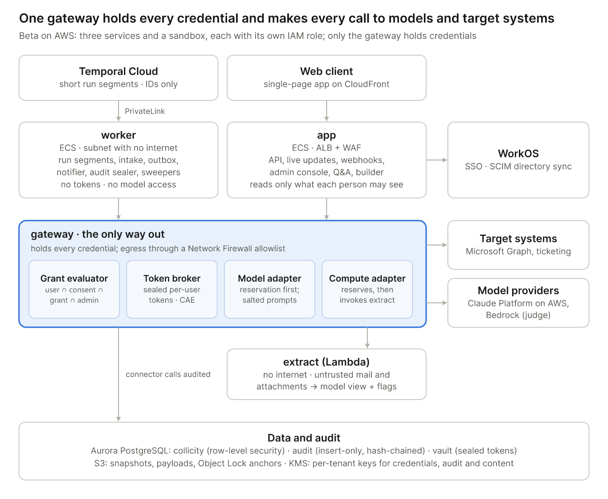
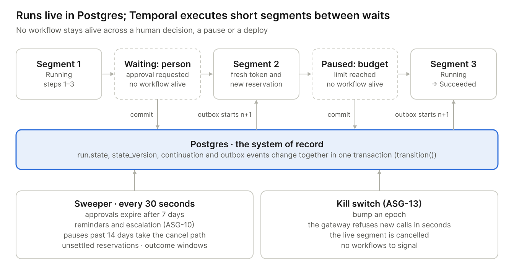
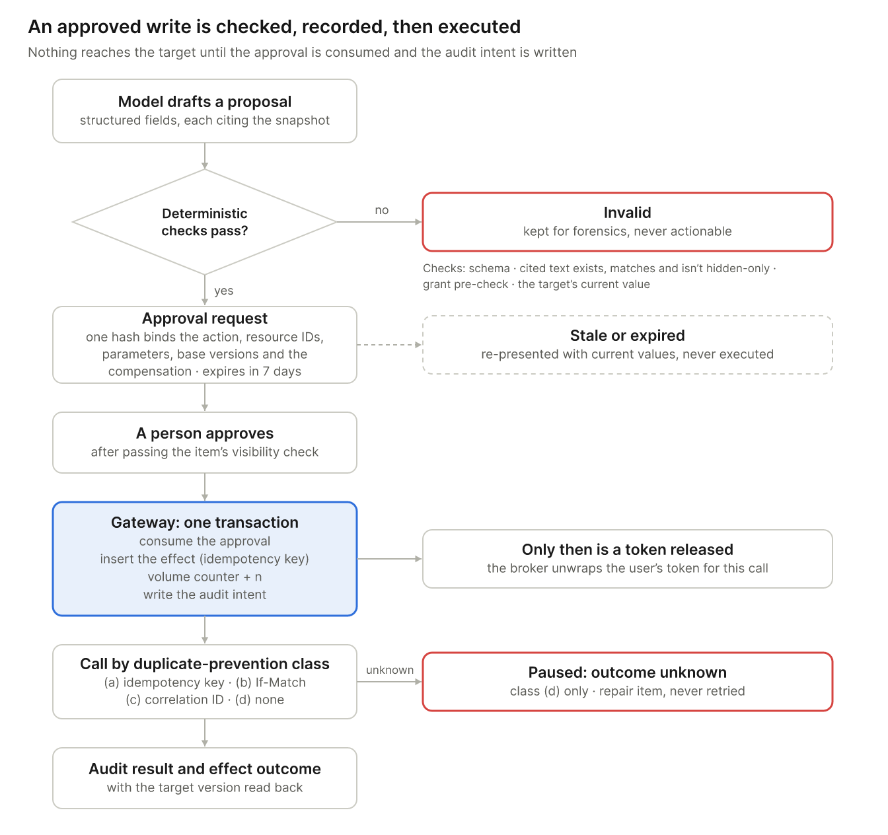
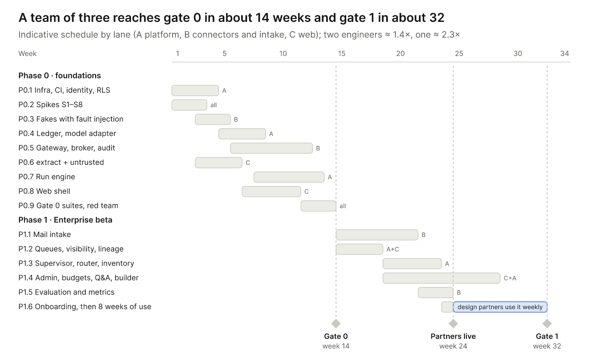

# Collicity — Technical Design (Draft v0.2)

Oct 5, 2026 · Draft for engineering review · Companion to *Collicity — Product Specification (Draft v0.5)*

## 1. Overview

This document turns the product specification (v0.5) into a system that can be built. It sets out:

- the stack;
- the architecture;
- the designs that keep the five product invariants true by construction;
- a work-package plan through the Enterprise beta (gates 0 and 1).

GA and Home are outlined at coarser grain. Requirement IDs refer to the specification.

**Decisions this document assumes** (2026-10-05)

| Decision | Choice | Consequence |
| --- | --- | --- |
| Cloud | AWS; one region for the beta, chosen by where the design partners need their data | Managed services throughout; US and EU cells at GA |
| Team | 1–3 engineers through the beta | Three services and one sandbox. Buy everything that isn't the product; defer whatever the beta matrix doesn't require |
| Scope | Every requirement in the §18 matrix's Beta column (82 IDs); GA and Home outlined | Every Beta requirement maps to a work package (§14) |

**Design principles**

1. **Invariants hold by structure, not by care.** Each invariant is enforced by something a bug in ordinary code can't bypass: an IAM role, a database role, a network tier, or the single code path every call must take.
2. **One enforcement point.** Every external call leaves through the `gateway`, which alone holds credentials and alone can reach the internet. That covers target systems, model providers and sandbox compute.
3. **Models propose; code decides.** Models return structured proposals. Only deterministic code changes state, and a side effect runs only against an approval that matches it exactly.
4. **Postgres is the system of record.** Run state, approvals, budgets, the audit log and the outbox live in one database. Temporal executes short segments and holds nothing it can't lose.
5. **Buy what isn't the product.** Identity, durable execution, hosting, observability and compliance tooling are bought. The gateway, run engine, ledger, intake and untrusted-content library are built.

## 2. Stack

Spec v0.4's stack defaults came from the archived compliance-assistant plan v3. Most stay. Several change because something fits a three-person team on AWS better, and several are deferred because the beta doesn't need them. Spec v0.5 adopts these decisions (§5, §16).

| Layer | Default in spec v0.4 | Decision | Reason |
| --- | --- | --- | --- |
| Compute | Kubernetes + Terraform | **Change:** ECS on Fargate + Terraform; EKS Auto Mode only if self-hosted delivery is ever needed | Three services don't justify running a cluster. Per-task IAM roles and security groups are the trust boundaries |
| Untrusted-code sandbox | WASM or microVM (CON-14) | **Decide:** Firecracker microVMs. Beta: a Lambda with no internet access (an S3 endpoint only) for content extraction. GA: Fargate tasks behind a proxy that injects credentials on the way out, for custom connectors | Managed isolation without running gVisor. The connector SDKs are TypeScript and Python, which WASM serves poorly |
| Backend | Python 3.12, FastAPI, Pydantic v2 | **Keep**, on Python 3.13 (3.14 during GA), with SQLAlchemy 2, psycopg 3 and Alembic; no PgBouncer in the beta | Strongest ecosystem for model SDKs, document parsing and statistics. Pydantic models double as structured-output schemas. 3.13 is supported to October 2029 |
| Orchestrator | Temporal | **Keep:** Temporal Cloud over AWS PrivateLink, running short run segments (§4). DBOS is the fallback | Nothing to operate. Short segments remove workflow-versioning risk and dual writes |
| Database | PostgreSQL 16 with RLS | **Change:** Aurora PostgreSQL on the newest major version Aurora supports (17; 18 once available), Serverless v2 outside production; RLS as SEC-09 specifies | Commits are durable across three Availability Zones, which gives the audit log RPO 0 if a zone fails |
| Live updates | Postgres outbox + Redis 7 | **Change for the beta:** no message broker. The outbox feeds Server-Sent Events, with Postgres LISTEN/NOTIFY as the wake-up. Valkey (ElastiCache Serverless) at GA if load needs it | One fewer system; SSE's `Last-Event-ID` is the outbox sequence |
| Object storage | S3-compatible | **Keep:** S3 with SSE-KMS under the tenant's `content` key (each write names it; S3 Bucket Keys limit KMS calls); Object Lock (compliance mode) for audit anchors | — |
| Vector store | pgvector or dedicated | **Defer** to GA (pgvector) | Beta retrieval is live federated search with the user's token (CON-09) |
| Policy engine | Cedar or OPA (CON-02) | **Change:** in the beta, a typed, deterministic grant evaluator in the gateway. Cedar arrives at GA with policies as code (ADM-08), custom connectors (CON-15) and the edge executor, tested against the beta evaluator on the same cases | The beta's grants are a small, closed rule set; property-based tests prove it more directly than policies would |
| Secrets vault | KMS/HSM-backed vault (CON-04) | **Decide:** KMS envelope encryption with ciphertexts in a `vault` schema. A KMS key per tenant for each purpose that holds tenant data (SEC-01): `credential` (the vault: connector tokens, CON-05 credentials and BYO provider keys), `audit` (wraps per-person keys and encrypts the tenant's audit archives) and `content` (S3 snapshots, payloads, prompts and outputs). The tenant is also in the encryption context. KMS rotates these keys automatically; customer-managed keys at GA (XKS or CloudHSM) rotate under the customer's control. Aurora is encrypted under its cluster key, and rows are isolated by row-level security (SEC-09; spec §21 asks whether rows need tenant keys too). Secrets Manager for service secrets; XKS or CloudHSM for customer-managed keys at GA | No Vault cluster to run. Per-tenant keys make customer-managed keys a key swap at GA for the data they cover. Per-person audit keys (SEC-07) are wrapped data keys, not 100,000 KMS keys |
| Sign-in | Hosted OIDC/SAML service | **Decide:** WorkOS for SSO, Directory Sync (SCIM) and its Admin Portal; AuthKit for consumer sign-in and passkeys in Home | Enterprise SSO and SCIM are beta-critical and commodity |
| Connector authorization | — | **Decide:** the token broker runs its own OAuth 2.1 consent per connector (authorization code with PKCE). The Entra application authenticates with client assertions signed by a KMS key that can't be exported. MSAL is configured for continuous access evaluation (CAE) | Sign-in tokens can't be exchanged for on-behalf-of tokens. Collicity's own application credential never leaves the HSM |
| Model providers | One hosted provider + bring-your-own | **Decide:** Claude through Claude Platform on AWS, signed with SigV4 from the gateway's task role, so no static key exists; token counting, Batches and `inference_geo` are available. A second model family on Bedrock judges across families, chosen by evaluation | Invariant 3 holds for the default provider by construction, with full Claude API parity inside AWS |
| LLM interface | — | **Decide:** a thin in-house interface over the official SDKs | Per-call reservations (BUD-03), decision records (RTR-04) and cache salting need control of every call |
| Internal connector protocol | Exposed internally as MCP (§6.1) | **Change:** in the beta, connectors are in-process adapters with MCP-shaped tool schemas. The MCP transport arrives at GA with remote and custom connectors and the desktop | One fewer network hop for first-party code. Grants, approvals and idempotency keys need first-class fields |
| Web | React + TypeScript | **Keep:** React 19 as a Vite single-page app on CloudFront, with TanStack Router and Query and React Aria Components. The manual builder is an **outline editor**, not a canvas | Accessible by default (PLT-06). A canvas costs weeks and is hard to make work with a keyboard or screen reader |
| Desktop | Tauri 2 | **Keep, decide at Phase 2** after a one-week spike on WebKitGTK and screen readers; Electron is the fallback | The local-connector sandbox is a Rust sidecar under either shell |
| Mobile | React Native / Expo (open, §21) | **Decide:** Expo, with custom native modules for HomeKit, App Intents and approvals signed with a device key | Mature background geofencing, actionable push and biometrics |
| Observability | OpenTelemetry | **Keep:** OpenTelemetry through the AWS Distro for OpenTelemetry (ADOT) to CloudWatch and X-Ray over VPC endpoints. GenAI spans carry no prompt or response content. Sentry in the browser only; PostHog with identifiers only | Works from the worker's no-internet tier, with the fewest vendors |
| Tooling | — | pnpm, uv, `just`, GitHub Actions, Semgrep, Dependabot, Syft, cosign. Turborepo and Cargo deferred | — |

**Model defaults.** Prices are per million input / output tokens and live in the price catalog (BUD-08), not in code.

| Use | Default | Price | Note |
| --- | --- | --- | --- |
| Triage, classification | Claude Haiku 4.5 | $1 / $5 | — |
| Extraction, drafting, tool use | Claude Sonnet 5.5 | $2 / $10 | — |
| Take-over (SUP-03), high criticality | Claude Opus 5.5 | $4 / $20 | Effort set explicitly per task |
| Grounded and subjective judging (SUP-02) | A non-Anthropic family on Bedrock | Catalog | Chosen on the labeled set in spike S7 |
| Excluded under zero data retention | Claude Fable 5.1 | $10 / $50 | Requires 30-day retention, so RTR-01 excludes it for tenants that require zero data retention (PRV-05) |

A refusal (`stop_reason: refusal`) counts as a failed attempt for that model (INV-07), and the router re-routes under a new reservation. Server-side automatic fallbacks stay off: they could pick a model outside the tenant's allow-list or reservation.

## 3. Architecture

Clients never call target systems or model providers. Everything leaves through the gateway, the one service that holds credentials and can reach the internet. The services that touch untrusted content hold no credentials.



### 3.1 Deployables

| Unit | Runs | Privileges and reach | Why it's separate |
| --- | --- | --- | --- |
| `app` | ECS behind ALB and WAF: REST API (OpenAPI), Server-Sent Events, Graph and WorkOS webhooks, admin console, Q&A, builder | Database role `app_user` with tenant and visibility RLS; egress to WorkOS and SES only | It serves people, so it can never read past what each person may see (SEC-08). Q&A prompts are assembled under the asker's RLS |
| `worker` | ECS in a subnet with no NAT: Temporal run segments and intake, outbox relay, notifier, audit sealer, sweepers, retention jobs | `app_worker`: tenant RLS, read-only on standing-instruction tables. Temporal over PrivateLink; AWS services over VPC endpoints | Untrusted data is handled and prompts are assembled with no tokens, no model access and no internet (invariants 3 and 5; SEC-12) |
| `gateway` | ECS behind NAT and an AWS Network Firewall domain allowlist: connector adapters, token broker, grant evaluator, model adapter, compute adapter, write-ahead audit | `gw`: the only role that can decrypt token keys with KMS, invoke Claude Platform on AWS, Bedrock and `extract`, or reach the internet | The single structural enforcement point for invariants 1–4 |
| `extract` | Lambda in a VPC with no internet route, S3 gateway endpoint only | None | The CON-10 sandbox. Only the gateway invokes it, after reserving its compute (BUD-03) |

Static assets are served from S3 through CloudFront. Temporal Cloud stores only identifiers, enums and error codes (§4.1), encoded with one platform KMS key, since Temporal holds no tenant content.

**Network tiers**

- **Public ingress:** CloudFront, and the ALB with WAF.
- **Restricted egress:** `app` reaches WorkOS and SES only. `gateway` goes out through the Network Firewall allowlist of declared hosts, which CON-12 manifests list.
- **No egress:** `worker` and `extract`.

**Hardening at GA**

- Split the token broker out of `gateway` into its own service.
- Add Valkey if live-update fan-out needs it.
- Add the EU cell; identifiers and hostnames are region-aware from day one.
- Add the Rust edge executor for the desktop and the on-prem relay.
- Add Cedar.
- Add dedicated worker pools for Enterprise tenants that require them (the spec's per-tenant execution workers, P1).

### 3.2 Request paths

**Model call** (invariants 3 and 4)

1. The caller (`worker`, or `app` for Q&A) reserves the worst case against every applicable ledger account in one transaction (BUD-10) and passes the reservation ID.
2. The gateway recomputes the worst case itself from the recorded price version:
   - input tokens, counted by the provider's token-counting endpoint, × the input price;
   - plus the cache-write premium on the cached span (an extra 0.25× for a 5-minute write, 1× for a 1-hour write);
   - plus `max_tokens` × the output price;
   - plus per-use tool fees.

   It refuses any reservation smaller than its own figure.
3. It re-checks RTR-01 eligibility (admin allow-list, classification label, residency, retention terms) and scans the prompt for fingerprints of live tokens and for honeytokens.
4. It prepends a cache salt, HMAC(tenant, visibility set). Provider caches are scoped to Collicity's own workspace or organization, not to a tenant, so the salt keeps cached prefixes from ever matching across visibility groups (SEC-08).
5. It marks the reservation *started*, calls the provider, and settles to the actual cost from the response's usage.

**Read call** (invariants 1, 4 and 5)

1. The worker presents an opaque step grant. It is a database row for one step and attempt (CON-04), valid only while the tenant, user, assignment and run *epochs* it recorded are current.
2. The gateway re-checks the user, the session and the connector (CON-06). It validates parameters against the pinned manifest, resolves resource parameters to stable IDs, and evaluates the capability grant (§5.2). A paid action also needs the caller's reservation (§5.1, BUD-03).
3. The broker supplies the user's token, and the adapter calls the target with the CON-07 `User-Agent`.
4. The response is filtered to granted resources and fields and stored in S3 under its data class. It comes back to the worker as a *content handle* carrying its source IDs and an `untrusted` taint (§8.2). An audit record is written.

**Write action** (invariants 1, 2, 4 and 5)

1. A model drafts a structured proposal. Before it is stored, deterministic checks run:
   - the schema;
   - citation integrity: the cited passage exists, matches the snapshot, and isn't hidden-only;
   - a capability pre-check;
   - the target's current value.
2. The proposal becomes an approval request. Its canonical hash (JSON Canonicalization Scheme, RFC 8785) binds the action, the resource IDs, the parameters, the item's base revision, the target's version and the declared compensation (§5.4). The request expires after 7 days (RUN-04).
3. A person approves. A delegate must pass the item's visibility check (SEC-08).
4. An action run calls the gateway. In **one transaction**, the gateway:
   - consumes the approval, or for a compensation checks that the original effect was applied and not yet reversed (§5.4);
   - inserts the effect row with a unique idempotency key;
   - increments the volume counter (compensations don't count) and marks a paid action's reservation started;
   - writes the audit *intent* record.

   Only then does the broker release the token.
5. The call proceeds according to the action's duplicate-prevention class (RUN-07). Then the audit *result* and the effect outcome are recorded, including the target version read back.

**Mail to runs** (§11)

1. A Graph change notification wakes the intake workflow of each assignment or instance that watches the scope; each reads the per-folder delta under its owner's token (CON-01), using immutable IDs.
2. Capture follows the archived compliance plan v3.1 §7: snapshot bytes to S3, then one transaction for the source rows and outbox events, then advance the checkpoint.
3. The gateway invokes `extract` to normalize the content (CON-10).
4. A trigger evaluator that reads only headers, and so costs no model calls, resolves sender identity (ASG-15) and applies the per-sender counter (ASG-17).
5. Trigger deduplication (RUN-02) and admission (RUN-01) start one intake run per email.

## 4. Runtime

Postgres owns every run's state. Temporal executes short segments between waits, so no workflow stays alive across a human decision, a pause or a deploy.



### 4.1 Runs and segments

- **State.** `run.state`, `state_version` and `continuation` change only through `transition()`, which checks the version and writes outbox events in the same transaction. The §7.6 states map one to one; terminal outcomes follow RUN-06.
- **Segments.** A segment is a Temporal workflow with the ID `run:{id}:{n}`: a thin, deterministic loop that calls `next_step` and `execute_step` activities.
  - Parallel branches and for-each loops run as child workflows, up to 50 items per child.
  - The task graph is interpreted inside activities, so most code changes never touch workflow replay. CI replays recorded histories to catch the rest.
- **Waits end segments.**
  - Entering a Waiting or Paused state commits the continuation and ends the segment.
  - A decision, resume or re-authorization commits segment n+1 together with an outbox event, and the relay starts it. The workflow ID makes the start idempotent.
  - Completed steps never re-run, and the next step always gets a fresh token and a new reservation (RUN-04).
- **Timers.** One sweeper, a Temporal Schedule running every 30 seconds, scans indexed deadlines:
  - approval expiry at 7 days;
  - ASG-10 reminders and escalation;
  - pauses older than 14 days, which take the cancel path;
  - unsettled reservations;
  - INV-06 outcome windows.
- **Kill switch (ASG-13).** Pausing a run, a user's runs or all runs bumps the run, user or tenant epoch. The gateway refuses new calls for that scope within seconds, and any live segment is cancelled; thousands of workflows never need a signal. Suspending a user is different: it deprovisions them (§5.6).
- **Temporal payloads.** Only identifiers, enums and error codes. Inputs, outputs and prompts are claim-checked: stored in S3 under their data class (spec §15) and referenced by ID.

### 4.2 Email triage as runs

- **Intake run, one per email:** triage → extract the requested items with citations → find the targets through gateway reads → draft action proposals → supervisor checks (§7.2) → persist queue items and approval requests. The run ends there, so RUN-01's default of 5 concurrent runs per assignment stays meaningful.
- **Action run, one per approved action.** Its trigger dedup key is the approval ID, so each approval executes at most once.
- **Long human waits** live in the work queue. Generic human steps (ASG-10) use the same park-and-resume mechanism. Inside a parallel branch or a for-each loop, a branch or item that reaches a human step runs as a child run with its own state and segments, so waits still end segments; the parent waits for its children.

### 4.3 Runtime semantics

| Rule | Implementation |
| --- | --- |
| RUN-01 Overlapping runs | Admission locks `assignment_slots`. Only Queued and Running runs count against the cap and the queue bound. A run that has executed a step resumes without waiting for a slot; one that paused before its first step returns to Queued in trigger order, and the policy applies to it as to a new trigger. Policies: skip; queue (bounded, first in first out); replace (the older run is cancelled at its next step boundary); concurrent (capped) |
| RUN-02 Trigger deduplication | `trigger_event.dedup_key` is unique, with an expiry. The mail key is (tenant, assignment or instance, mailbox, Graph immutable message ID), never the Message-ID the sender chooses, with a window at least as long as the 90-day monitored window. The same key derives the workflow ID |
| RUN-03 New versions | Admission resolves the latest or pinned version. A version that isn't accepted and either widens any grant element (§5.2) or raises the budget → Paused: re-acceptance; accepting it returns those runs to Queued in trigger order (RUN-01). An instance of a shared assignment runs only the version its recipient accepted (ASG-23) |
| RUN-04 Credentials after waits | The broker fetches a token on every call. Approvals bind by canonical hash, expire after 7 days (state `expired`), and go stale when either base version changes |
| RUN-05 Revocation mid-run | Epochs are checked on every call. A result that lands after revocation is quarantined and never returned. The run moves to Paused: re-authorization, or takes the cancel path if the user was deprovisioned |
| RUN-06 Failure and compensation | An effect journal records every applied effect. Retryable steps retry within budget. Otherwise compensations run in reverse order through the gateway, ending Rolled back. Any failed compensation or irreversible effect ends Completed with partial side effects, with a repair item |
| RUN-07 Duplicate prevention | Classes (a) and (b) retry safely. Class (c) waits out the declared read-after-write lag, finds the object by correlation ID, then retries or records the result. Class (d) never retries: Paused: outcome unknown, with a repair item |

If an owner is deprovisioned after effects were applied, there is no delegated token left to compensate with. The run ends Completed with partial side effects, and its open repair items go to a custodian the tenant designates (RUN-06). A custodian's repair item rests only on the applied effects and their target resources, not on the run's sources, so it stays within SEC-08: the custodian sees it if they can read those targets. For an outcome-unknown write, the item shows only the action, target, account, attempt time and correlation ID. Items no custodian can see are flagged to tenant admins with identifiers only (RUN-06).

### 4.4 Versions and the builder

- **Immutable versions (ASG-01).** Assignments and tasks are versioned. A version is accepted only through `accept_version()` (§8.2). The acceptance screen shows the widening diff and the provenance of every standing instruction.
- **Manual builder (ASG-04).** An outline editor with steps, branches, parallel blocks and for-each blocks. Task forms cover the description, capability grants (with resource pickers backed by gateway reads), the model or "Auto", success criteria, approval gate, timeout and retry.
- **"Write this for me" and "Improve" (ASG-02)** draft a description that the person must accept. They are charged to the person's workspace budget (BUD-11, §6.1).
- **Dry run (ASG-05)** runs the version with read-only grants. Write capabilities are stripped before step grants are issued. It reports what would happen and its real token cost.
- **Success criteria (ASG-06)** are chosen from the typed check library (§7.2) with parameters. Free-text criteria become subjective checks for the judge.

### 4.5 Sharing (GA)

Spec §7.7 gives two ways to share, and neither lends anyone the owner's access. In the beta, reports are shared as one-off snapshots; assignment sharing and recurring report sharing arrive at GA.

- **Report sharing (ASG-19)** reuses snapshots (SEC-10). A `report_share` row holds the assignment version, the recipients (people or groups), the source scopes and label ceiling the owner confirmed, and a state (active, held, withdrawn). For each new edition, a publish activity checks:
  - the edition comes from the confirmed version, and every source in its lineage lies within the confirmed scopes;
  - its label is no higher than the confirmed edition's and needs no second approver;
  - the supervisor didn't flag it and SEC-13 screening found nothing;
  - each recipient, including each current group member, meets SEC-10's recipient rules;
  - the owner can still read every source and holds the Publisher permission.

  If all hold, it publishes the snapshot. Otherwise it holds the edition and asks the owner to confirm again; if the owner has lost access to a source, nothing publishes until they regain it.
- **Instances (ASG-20).** Sharing with named people creates an `assignment_instance` for each; a group or tenant share creates one only when a member opens the offer, with SCIM group events driving joins and leaves.
  - Each instance has its recipient as owner and a state: offered, blocked (something missing), active, or ended with a reason (withdrawn, declined, left, archived).
  - It records the version its recipient accepted and any newer version on offer, its own resolutions of personal selectors, its triggers (mail triggers on the recipient's resolved folders; webhook triggers with their own endpoint and secret) and an assignment budget under the recipient's user budget.
  - Admission (RUN-01) starts runs only for an active instance, on its accepted version. Every run, approval, step grant and audit record carries the instance owner, so the gateway always sees the recipient as the principal. A pre-authorization applies only to the instance it was made for.
- **Acceptance and versions (ASG-23).** `accept_version()` records acceptance per instance, by its owner only. A new version is recorded as an offer and changes nothing until the recipient accepts it on a screen that shows the diff of instructions, capabilities and provenance against the version the recipient last accepted, never against the previous published version; a version that widens anything beyond the accepted version re-runs the whole precheck first. The acceptance screen hides the names of resources and sources the recipient can't read, and the share screen shows the owner what recipients will see.
- **Access precheck (ASG-21)** has two stages.
  - At share time, Collicity checks its own records for each recipient: role, admin policy for each connector and action, model eligibility (the pinned model or, on Auto, the curated default, against the recipient's own policy and configured providers) and budget headroom.
  - When the recipient opens the share, they connect any missing connector. Each connector's access check then runs under the recipient's own token and reads only their access to the declared resources; for Graph, that is a metadata read of each resource as the recipient, and write access is verified where the target offers an effective-permission check and is otherwise unverifiable.
  - Results are stored per requirement with the principal that ran them, always the recipient, and shown to the owner only for resources the owner can read. A denied check is recorded as a result, never as an out-of-policy call (CON-03).
  - After acceptance, a dry run the recipient starts settles unverifiable reads, charged to their workspace budget; the instance's triggers start only when it passes.
- **Access requests (ASG-22)** are `access_request` rows: route, recipient, resource, operation, the person it was filed as and approved by, state (open, granted, rejected, expired, stale, withdrawn) and a 7-day expiry.
  - Policy, budget and consent requests stay inside Collicity.
  - An IT-queue ticket runs as a one-step run of a built-in access-request assignment under the requester's identity, with a fixed grant the tenant admin sets (one ticketing connector, one queue, allowlisted fields, a per-person daily limit). It takes the normal write path (§5.1) with the requester's approval of the exact ticket, and is charged to the requester's workspace budget.
  - Collicity never changes a target's permissions. It re-runs the precheck when a grant lands, withdraws requests when a share ends, and tells granters when the access is no longer needed.
- **Intake per instance.** Each instance's mail trigger has its own intake workflow under its owner's token, and its dedup keys include the instance (RUN-02). At acceptance, if another instance of the same assignment already watches the same fixed mailbox, the screen says so and offers a delegate role (§18.1) or a report share instead.
- **Ending (ASG-23).** Withdrawing a report share stops its editions. Withdrawing an assignment share, a recipient leaving, or the assignment being archived disables the instance's triggers and admission; runs already started finish their current step and end through RUN-06. Version rows stay while any instance's run is pinned to them. Admins can pause every instance of one assignment through its epoch (ASG-13).

## 5. Connector gateway

The gateway decides whether a call is inside the permission ceiling before any credential exists for it, and records that decision before anything leaves.



### 5.1 Request path

1. **Load the step grant.** Check that the run is Running, its version is accepted by the run's owner (for an instance, by its recipient), the user is active with current epochs, and the connector is still approved (CON-06). These are read from Postgres, cached for at most 5 seconds and invalidated by LISTEN.
2. **Validate parameters** against the pinned manifest, and identify the resource and recipient parameters. An action whose resource can't be determined before the call needs approval every time (CON-02).
3. **Evaluate the grant** (§5.2), denying by default. A denial writes a `denied` audit record and ends the step. Repeated denials suspend the task and raise a security event (CON-03). Then check the action's cost model in the pinned manifest (BUD-03): an action without one is refused, and a paid action needs the caller's reservation, which the gateway checks against its own worst case at the recorded price version and marks started just before the call (inside the step-4 transaction for a write).
4. **For a write, one transaction:**
   - consume the approval (accepted, unexpired, hash match, unused); for a compensation, check instead that the original effect was applied and not yet reversed, since its approval may already be used or expired (invariant 2);
   - insert the effect row (unique idempotency key);
   - increment the volume counter, only if `used + n ≤ limit` (compensations don't count, CON-02);
   - write the audit intent.
5. **Release the token.** The broker unwraps the refresh token with the tenant's `credential` key and refreshes it with the CAE capability. The access token stays in memory only.
6. **Make the call.**
   - A 401 or 403 ends the step, with no retry.
   - A CAE claims challenge moves the run to Paused: re-authorization.
   - A timeout or lost acknowledgement is handled by the action's RUN-07 class.
7. **Filter and record.** The response is filtered to granted resources and fields, the payload goes to S3 with its lineage, and the audit result and effect outcome are written. A paid call's reservation settles to the target's reported charge; if the outcome is unknown (RUN-07), it stays started and is charged in full (§6.2).
8. **Revocation** bumps an epoch, and new calls stop at once. A call already in flight is logged "completed after revocation" and quarantined (RUN-05).

### 5.2 Capability grants

The beta evaluator is a pure function over typed values:

`(manifest, grant, admin policy, consented scopes, request) → allow | deny(reason)`

Each element of CON-02 has a typed form:

| Element | Typed form | Enforced |
| --- | --- | --- |
| Connector and action | Manifest action ID, pinned manifest version | Before the call |
| Resource selector | Stable IDs resolved at acceptance: drive item and table ID, site and list ID, mail folder ID | Before the call; responses filtered after |
| Field allowlist | Typed read and write sets; each field has a type (number, text, date, choice) | Writes before the call; reads filtered after |
| Recipient rule | `original_sender_only` resolves to the authenticated From address at medium or high confidence | Before the call; drafts read back after |
| Parameter limits | Bounds per field (e.g., a change of at most 50 units); forbidden operations | Before the call |
| Volume limit | A count per run or per period | Atomic counter in the write transaction |

- **Stable IDs.** Selectors resolve to the target's immutable identifiers when a version is accepted, so renaming a workbook or folder can never widen a grant. If a fixed selector's resolution changes, that is a new version (RUN-03). A personal selector resolves per instance when its recipient accepts (ASG-20), and `widens()` compares an instance's resolutions only with its own earlier ones.
- **Widening.** `widens(old, new)` is a subset check on each element. Any widening needs re-acceptance (RUN-03, invariant 2).
- **Typed writes.** Text written to Excel or SharePoint is escaped so it can't become a formula; `=WEBSERVICE(…)` or `=HYPERLINK(…)` would send data out. Number fields accept only numbers.
- **Reply drafts.** Graph's reply drafts may follow a Reply-To header that the sender controls. The adapter therefore sets `toRecipients` explicitly from the authenticated From address, and reads the draft back to verify its recipients before recording success. Spike S3 confirms the behavior.

### 5.3 Tokens and attribution

- **Consent (CON-01, CON-08).** Each connector uses OAuth 2.1 authorization code with PKCE, and scopes never exceed the manifest. At consent, the upstream tenant and object IDs (`tid`, `oid`) must match the signed-in person's SSO subject, or the connection is rejected; nobody can connect someone else's account.
- **Sealing (CON-04).** Refresh tokens are encrypted with KMS envelope encryption (the tenant's `credential` key, with the tenant also in the encryption context) and stored in the `vault` schema. Only the gateway's task role can decrypt them (CON-04). Each refresh seals the new refresh token the identity provider returns and destroys the old ciphertext. Access tokens live in memory, are restricted to their audience, and are never logged. DPoP or mTLS binding is added for targets that support it; none of the beta targets does.
- **Attribution (CON-07).** Every call carries `User-Agent: Collicity/<version> (agent; run=<run-id>)`, the `act` claim where the target supports token exchange, and an audit record. Each connector's documentation states what the target's own log will show.
- **Systems without OAuth (CON-05)** are built only if a design partner needs them. Personal credentials are sealed the same way.

### 5.4 Approvals and compensations

- **Compensation.** The approval hash covers the action and its **declared compensation, with exact restore values** (for example, restore Qty to 10). A pre-authorization (GA) covers the declared compensation, and the restore values are recorded when the action runs. Either way the compensation runs under the original authorization, even after it was used, expired or was revoked (invariant 2, RUN-06); it needs no model. A paid write's reservation also covers its declared compensation's worst case, so a compensation never waits for budget; that part is released when the run ends without needing it (BUD-03). The write's grant also covers its declared compensation, only to reverse an effect the run applied and outside the volume limit (CON-02).
- **Request states:** pending, blocked, invalid, accepted, rejected, stale and **expired**, when the expiry passes before the request is decided or its action runs (RUN-04).
- **Delegates.** A delegate's approval executes with the queue owner's token. The delegate must pass the item's visibility check, and the audit record names the queue owner as the user and the delegate as the approver (CON-07, §18.1).

### 5.5 Beta actions

| Action | Duplicate prevention (RUN-07) | Recovery (RUN-06) | Spike S3 confirms |
| --- | --- | --- | --- |
| Update a row in a named Excel table | (b) If-Match on the row, else (c) a correlation column | Compensable: restore prior values | If-Match support; formula handling |
| Create or update a SharePoint list item | (c) for creates; (b) or (c) for updates | Compensable: delete or restore | ETag support; read-after-write lag |
| Create or update a ticket in the partner system | (a) if the system enforces idempotency keys, else (c) | Compensable: close as created in error, or restore fields | Idempotency support |
| Draft a reply in the user's mailbox | (c) a correlation ID in an extended property | Compensable: delete the draft | Filtering on the extended property; Reply-To behavior |

### 5.6 Deprovisioning (CON-06)

1. A deprovisioning signal (a WorkOS directory event, an admin suspension, or a disabled account found by the optional directory poll) commits one transaction:
   - the person is suspended and their epoch bumped;
   - their grants and connections are revoked;
   - their runs are paused or routed down RUN-06.
2. Through the outbox, the gateway then destroys their sealed tokens and cancels live segments.
3. The gateway refuses their calls within seconds of the signal.

Measured from the identity provider, 60 seconds is out of reach through SCIM alone. Microsoft Entra provisions on a cycle of about 40 minutes, and CAE critical events can take up to 15 minutes to propagate. The design therefore:

- measures from receipt of the signal;
- uses CAE, so Graph rejects a disabled user's tokens even before the signal arrives; a CAE challenge on its own only moves the run to Paused: re-authorization, because it doesn't say why access changed;
- lets a tenant allow admin-consented polling of Graph's user delta at least every 30 seconds, under an application permission the tenant admin grants; each disabled account it finds is a deprovisioning signal (CON-06).

## 6. Budgets and ledger

Every billable operation reserves its worst case before it starts, against every applicable account in one transaction. The reservation then settles to the actual cost.

### 6.1 Accounts

- **Accounts:**
  - organization, user and assignment, per period (BUD-01; BUD-06 without groups in the beta);
  - the run itself, for the per-run cap;
  - a **workspace budget** (BUD-11) for work not charged to an assignment: Q&A (QA-01–03), "Write this for me" (ASG-02) and dry runs (ASG-05). It sits under the user budget, or the account cap in Home; from GA, chat has its own budget at the same level (QA-04, BUD-11).
- **Money** is stored as integer micro-USD, and each reservation records its price-catalog version (BUD-08).
- **Lock order.** Rows are always locked in the same rank order: organization, group (GA), user, assignment, workspace or chat (GA), run.

### 6.2 Reserve, start, settle, expire

`reserve()` is one PL/pgSQL call:

```sql
SELECT id FROM ledger_account WHERE id = ANY($accounts)
  ORDER BY lock_rank, id FOR UPDATE;
-- if any account has spent + reserved + $amount > limit:
--   return that account (BUD-04 routes the request to its owner) and reserve nothing
UPDATE ledger_account SET reserved = reserved + $amount WHERE id = ANY($accounts);
INSERT INTO reservation (..., state => 'active', expires_at);
INSERT INTO ledger_entry (...);
```

| State | Meaning | On expiry |
| --- | --- | --- |
| active | Reserved, not yet dispatched | Released |
| started | The gateway is about to dispatch, or has | Charged in full, then reconciled against provider usage where the provider reports it (BUD-03) |
| settled | Actual cost recorded | — |

- **Overruns.** An actual cost above its reservation is a guardrail event, because it means the cost model is wrong.
- **Batch reservations** last at least 24 hours.
- **Worked example.** Sonnet 5.5 with 10,000 input tokens, 8,000 of them written to a 5-minute cache, and `max_tokens` of 2,000: $0.020 input + $0.004 cache-write premium + $0.020 output = **$0.044** reserved.
- **Compute** reserves its maximum duration × rate, and the Lambda timeout is the hard stop.
- **Estimates (BUD-02).**
  - The first estimates come from dry-run actuals, then from trailing medians per task and model.
  - Each task's `max_tokens` is set from its 99th-percentile output, so worst-case reservations don't pause runs needlessly near a limit.
  - Gate 1 needs 80% of runs within ±25% of their estimate.

### 6.3 Authorization and alerts

- **Paused runs (BUD-04).** A paused run shows what was spent, what remains, the blocking account and the estimate to finish. Only that account's controller can raise it, either once or permanently. Each raise is recorded as a `limit_change` row and audited; nothing increases automatically.
- **Alerts (BUD-05).** Thresholds fire once per period per account, in-app, by email and by browser push in the beta, and to Slack, Teams or webhooks through incoming-webhook URLs that the gateway calls (allowlisted hosts). Defaults: notify at 50%, 80% and 95%; pause at 100%.
- **Scale path.** One reservation holds its row locks for well under a millisecond, which is enough for hundreds of reservations a second on one organization row; spike S5 measures it. If contention appears: pre-allocated budget chunks per user, or TigerBeetle behind the same interface.

## 7. Models: router, supervisor, inventory

The router starts every task type on a curated default and moves to cheaper models only as verified evidence accumulates. Every check writes evidence, and the evaluation set measures what the checks miss.

### 7.1 Router

- **Eligibility (RTR-01).** Admin allow-list ∩ configured providers ∩ capabilities (tools, vision, context, structured output) ∩ the data's classification and residency ∩ retention terms (PRV-05).
- **Selection (RTR-02).** The routable unit is a model version at an effort level. Among eligible units, pick the lowest ĉ / p_LB among those whose lower bound clears the task's quality bar, with priors per RTR-07.
- **Fallback.**
  - With priors capped at 10 pseudo-attempts, a strong prior of 0.9 is Beta(9, 1), whose 5th percentile is about 0.72.
  - A model therefore needs roughly 20 consecutive verified successes to clear a 0.9 bar, and more from a 0.5 prior.
  - Until one clears the bar, each task type uses a **curated default model with full supervision** (every check runs on every attempt, SUP-02). This is the beta's "rule-based router" (RTR-02).
  - If the default isn't eligible for a task (RTR-01), the fallback is the eligible unit with the highest lower bound, ties going to the lower estimated cost. With no eligible unit, the step fails before any model call, and the decision record says which condition excluded each model (RTR-04).
- **Records.** Each decision records its candidates, scores and a plain-language reason (RTR-04). Overrides follow RTR-05. Exploration (RTR-06) is GA.

### 7.2 Supervisor (SUP-01 to SUP-04)

- **Deterministic checks** come from a typed check library, selected by each task's success criteria (ASG-06): schema, row counts, totals, referenced IDs exist, citation integrity, not hidden-only. They run first and gate delivery.
- **Judging.** A judge from a different model family checks grounding. Subjective checks are sampled according to criticality, except under the RTR-02 fallback, where every check runs on every attempt (SUP-02).
- **Interventions** follow SUP-03's ladder. Each spends from the budget of the work it checks (the assignment budget, or the workspace budget for a dry run; SUP-03, BUD-11) and appears on the run timeline.
- **Evidence.** Every check writes an append-only evidence record: class, check ID, result, judge model and version, and input hashes.

### 7.3 Inventory and evaluation (INV-01–03, 06, 07; SUP-06)

- **Inventory.**
  - Raw evidence and outcome events are stored; scores are derived from them.
  - Labels stay provisional through the 7-day outcome window. A nightly job then finalizes them and updates posteriors.
  - Attribution follows INV-07.
- **Evaluation set (SUP-06).**
  - **Sampling.** A sampler draws runs stratified by task type and criticality. For triage it also draws inputs stratified by pipeline stage, including pre-filter drops and mail that matched no trigger.
  - **Adjudication.** Reviewers who are entitled to the data adjudicate without seeing the supervisor's verdict.
  - **Metrics.** Recall uses the stratified bootstrap (archived AC-15); precision counts adjudicated items only (AC-16).
  - **Re-runs.** After model or prompt changes, labeled sets are re-run through the Batches API, at half price.

## 8. Untrusted content, lineage and rendering

Untrusted content is normalized before a model sees it and tracked through everything derived from it. It is rendered so that it can't fetch anything (spec v0.4's hardening: CON-10, SEC-11, SEC-12, ASG-17).

### 8.1 Normalization (CON-10)

The `untrusted` library runs only inside `extract`. It returns a *model view*, an offset map back to the original, and flags; the original stays in the snapshot.

| Source | Hidden content flagged |
| --- | --- |
| Mail HTML | Text hidden by the CSS cascade (display, visibility, zero size, colour matching the background, off-screen); comments; zero-width characters |
| XLSX | Hidden and very-hidden sheets; hidden rows and columns; `;;;` number formats; font colour matching the fill; comments; metadata |
| DOCX | Hidden (vanish) text; comments; tracked deletions; metadata |
| PDF | Invisible render mode; text coloured like its background; text outside the page; metadata |

- **Unicode.** Text is normalized with NFKC, keeping the offset map. Tag characters and bidirectional controls are stripped and flagged. Mixed-script look-alikes are mapped to their UTS #39 skeleton and flagged (CON-10).
- **Encoded payloads.** Base64, hex and URL-encoded runs are decoded, with a depth limit, for inspection. In the model view they are replaced by a flagged placeholder.
- **Hidden regions** never enter the model view. Reviewers see them with a "hidden in original" marker, and quotes are rendered from the snapshot by offset (SUP-01).
- **Prompt delimiters.** Delimiting and labeling untrusted text in prompts is hygiene only, not a control.

### 8.2 Lineage (SEC-12, SEC-08)

- **Lineage rows.** Every artifact (step output, queue item, draft, answer, export) has a `lineage` row listing its sources, with an `untrusted` taint. Any untrusted input makes the output untrusted, through later steps, runs and exports.
- **Visibility.** The same lineage drives visibility. An artifact is visible to the people who can currently read every source in its lineage (SEC-08), including content pulled in by reads the model initiated.
- **Standing instructions** are task descriptions, template prompts, assignment versions, builder output, saved chat context and supervisor suggestions.
  - They are read-only to `app_worker`; `app_user` may insert drafts.
  - Only `accept_version()` makes a draft current. It is a SECURITY DEFINER function that requires an interactive session belonging to a person, and its acceptance screen shows provenance.
- **Prompt builder.** It accepts two types only: `TrustedText` (from accepted versions) and `ModelView` (normalized untrusted content). System prompts hold no secrets.

### 8.3 Rendering (SEC-11)

- **Sanitizing.** The server sanitizes model output to an allow-listed Markdown tree, and the React renderer never emits remote images, frames or forms.
- **Links** show their true host. Links to domains outside the tenant's allowlist open through an interstitial; the allowlist is a tenant setting that admins manage (SEC-11).
- **Defense in depth,** so that even a sanitizer bug can't fetch anything:
  - `Content-Security-Policy: default-src 'self'; img-src 'self' blob: data:; frame-src 'none'; form-action 'self'; base-uri 'none'`;
  - Trusted Types;
  - `Referrer-Policy: no-referrer`.
- **Original mail HTML** appears only in a sandboxed iframe.
- **Exports** are escaped against formulas and rendered with networking disabled.

### 8.4 Sender throttling (ASG-17)

Per-sender counters are checked in the admission transaction:

- by default, items beyond 20 queue items per sender per day go to a review lane;
- bursts of near-duplicate requests are flagged;
- each sender's auto-execution cut-off is recorded from the beta, although auto-execution itself (ASG-16) ships at GA.

## 9. Visibility, live updates and Q&A

Every read path is bounded by the database: tenant isolation and source visibility are row-level security, not only application checks.

- **Tenant isolation (SEC-09).** Every tenant table has FORCE ROW LEVEL SECURITY.
  - Roles: `migrator` (table owner, CI only), `app_user`, `app_worker` and `gw`. No application role owns a table or has BYPASSRLS.
  - Tenant and person are set per transaction from the authenticated identity, with `set_config(…, true)`. Workers set both the same way.
- **Visibility (SEC-08).** Visibility sets are materialized from current source ACLs and recomputed on ACL events and reconciliation. `app_user` reads content rows through an RLS visibility predicate as well as tenant RLS, so the database itself bounds API reads, Q&A prompt assembly and exports.
- **Live updates.**
  - Events carry IDs only.
  - The relay assigns each event its per-tenant sequence at publish time; assigning it at insert would skip rows that commit late.
  - Clients resume with SSE's `Last-Event-ID` and re-fetch details through the API.
- **Notifications** check visibility at send time, carry no content in their titles, and are dropped for revoked recipients. The client cache is bounded and purged on `access.revoked`.
- **Q&A (QA-01–03).** Answers are assembled in `app` under the asker's RLS, cite run steps, data rows and documents, and carry the lineage taint of what they cite.
- **Snapshots (SEC-10).** A published snapshot is a frozen copy with its own access list:
  - it carries the most restrictive label among its sources;
  - questions about it are answered only from its own content;
  - withdrawing it purges recipients' caches;
  - publish, view, flag and withdrawal are audited.

## 10. Audit log

Every connector call is audited twice: once as intent, before any token is released, and once as result. The log is tamper-evident without ever holding payloads.

- **Storage.**
  - An `audit` schema on the same Aurora cluster. Every role gets INSERT only, and a trigger rejects UPDATE and DELETE.
  - Aurora's three-zone durability gives RPO 0 if a zone fails. Losing the whole region is a GA disaster-recovery item (spec §17).
- **Contents.** Identifiers and hashes only, never payloads or prompt text (SEC-07):
  - intent and result for every connector call;
  - denials and approvals;
  - budget authorizations;
  - admin changes and version acceptances;
  - revocations;
  - snapshot events;
  - share events: offers, acceptances, declines, withdrawals, departures, precheck results and access requests.
- **Personal fields** are encrypted with per-person data keys, which are themselves wrapped by the tenant's `audit` key. Search uses blind indexes (keyed hashes, HMAC), stored per person outside the hash chain. Crypto-shredding deletes the wrapped key and the person's blind-index entries; the chain still verifies, and erasure is complete once backups older than the deletion expire (SEC-07).
- **Hash chain (ADM-07).**
  - The sealer appends `(tenant, chain_seq, record_id, prev_hash, hash)` over the encrypted fields.
  - Every hour a KMS-signed chain head is written to S3 under Object Lock.
  - The chain is verified daily.
  - Monthly partitions are archived as Parquet under Object Lock for 1–7 years.
- **Security monitoring (ADM-06, beta without SIEM export).** The admin console's activity feed, policy denials and anomaly alerts read the audit log. Alerts cover unusual volume, new destinations and repeated denied calls.

## 11. Intake

The beta's intake reuses the archived compliance-assistant plan v3.1 design; this table maps it onto Collicity.

| v3.1 concept | Collicity |
| --- | --- |
| `source_object`, `source_version`, deduplicated on (tenant, connector, scope, source_id, version) | Same tables. The version is a hash of the normalized message, because Graph's change key changes when mail is read or flagged. IDs come from `Prefer: IdType="ImmutableId"`. Copies of a message in more than one scope are matched by a hash of the normalized message, sender and sent time, never by the sender-chosen Internet Message-ID that v3.1 used as `content_identity` (RUN-02, §18.1) |
| Capture before checkpoint, outbox, 410 resync, reconciliation, sync gaps | One intake workflow per scope and per assignment or instance, under its owner's token: notifications only wake it, and the delta query does the reading. Daily reconciliation also refreshes `current_acl` |
| `mail_auth`, `sender_identity`, identity confidence | Only the Authentication-Results header stamped by the tenant's own Microsoft 365 boundary is trusted. ASG-15 levels apply. Low-confidence mail goes to the review lane and never triggers a run |
| Deterministic pre-filter, suppression floor | The header-only trigger evaluator (monitored folder, sender rule, ASG-17 counter). The floor forces human review |
| Triage → synthesis | The intake run (§4.2) |
| Obligation | `queue_item`, with the §18.1 lifecycle. `assignment_status` and `repair_status` are separate fields; v3.1 already kept assignment status apart (§18.1) |
| Proposal states | `approval_request`, with v3.1's states plus `expired` and a new `action` kind |
| `content_flags` | The model view excludes hidden regions and stripped characters; reviewers see markers |
| Stage-outcome strata, 90-day retention | The SUP-06 sampler, including pre-filter drops |

Supported beta inputs follow §18.1:

- the user's own mailbox, and shared mailboxes they can read;
- selected folders, within a 90-day monitored window;
- attachments up to 10 MB (PDF, DOCX, XLSX);
- English only.

## 12. Data model

| Area | Tables | Columns that carry the invariants |
| --- | --- | --- |
| Tenancy and identity | `tenant`, `principal`, `group`, `role_grant` | `home_region`; `principal.status`, `kind` (person or service), `epoch`, `idp_subject` |
| Standing instructions | `assignment`, `assignment_version`, `version_acceptance` | Immutable task graph, grants, budgets, manifest pins, content hash, taint; `accepted_by` (a person; per instance for a shared assignment, and always its owner); widening diff |
| Connectors | `connector_manifest`, `connection`, `vault.token`, `step_grant`, `capability_usage` | Signed manifest (action classes, recovery and duplicate-prevention classes, resource parameters, cost model, replay window, hosts, access check); bound `tid`/`oid` and consented scopes; ciphertext readable only by `gw`; grant expiry and epochs; `used ≤ limit` |
| Execution | `run`, `run_step`, `trigger_event`, `effect`, `repair_item` | `state`, `state_version`, `segment_no`, `continuation`, `price_version`; unique dedup key with expiry; unique idempotency key, `params_hash`, class, outcome (sending, applied, unknown, failed, compensated), prior values |
| Approvals | `approval_request` | Canonical parameters and hash; both base versions; bound compensation; visibility set; state (including `expired`); `expires_at`; `consumed_at` |
| Intake and queue | `source_object`, `source_version`, `scope_sync`, `sync_gap`, `queue_item`, `evidence_link`, `review_decision`, `sender_counter` | `current_acl`; identity confidence, content flags, references to the model view and offset map, stage outcome; item status, `assignment_status`, `repair_status`, approved fields, revisions |
| Lineage and visibility | `lineage`, `visibility_set`, `visibility_member` | Sources and taint; the RLS predicate for `app_user` |
| Budget | `ledger_account`, `reservation`, `ledger_entry`, `limit_change`, `price_version` | Limit, spent, reserved, lock rank, alerts sent; reservation state |
| Models and quality | `model_catalog`, `router_decision`, `model_call`, `evidence_record`, `attempt`, `adjudication` | Provider terms (retention, zero data retention, region); labels provisional until the outcome window closes |
| Audit and outbox | `audit.record`, `audit.seal`, `audit.anchor`, `person_key`, `outbox_event` | INSERT-only; chain hashes; sequence assigned at publish; visibility set |
| Sharing (GA) | `report_share`, `assignment_share`, `assignment_instance`, `access_check`, `access_request` | Report share: version, recipients, source scopes, label ceiling, state (active, held, withdrawn). Instance: owner is the recipient; state (offered, blocked, active, ended with a reason); accepted and offered versions; personal-selector resolutions; triggers with their own webhook endpoint and secret; budget account. Access check: requirement, result, the principal that ran it (always the recipient). Access request: route, filed as, approved by, state, expiry, the version scope it applies to |

**Retention and deletion (SEC-04).** Retention jobs enforce the spec's §15 data-class table:

- connector payloads are kept for the run plus 7 days, or 90 days for discarded items and the evaluation set;
- prompts and model outputs, 30 days by default;
- derived metadata is pseudonymized when a person is removed;
- audit records follow §10.

A person's export and deletion requests run per class.

## 13. Repository and environments

```text
apps/web                     Vite + React single-page app (client and admin console)
packages/ui, api-client      React Aria design system; client generated from OpenAPI
python/                      uv workspace
  services/                  app, worker, gateway, extract
  libs/                      core, db (RLS sessions, Alembic), ledger, grants, broker, llm, router,
                             supervisor, connectors (graph, partner ticketing), intake, untrusted,
                             lineage, audit
  testing/                   fake Graph, fake ticketing, external receivers, scripted and malicious
                             model stubs, honeytokens
schemas/                     connector manifest, capability grant, assignment DSL, events (JSON Schema)
infra/terraform              VPC (three egress tiers), Aurora, ECS, Lambda, KMS, S3, CloudFront, WAF,
                             Network Firewall, Temporal PrivateLink
tests/                       invariants, redteam, acceptance, e2e
```

- **Local development.** `just dev` starts Postgres, the Temporal dev server, LocalStack (S3, KMS, Lambda) and the fakes in Docker Compose.
- **Environments.** dev, staging and prod in the beta region, with prod-eu at GA. Configuration comes from the environment and feature flags, never from code branches.
- **CI.**
  - Lint and types: ruff, pyright and Biome.
  - Tests: pytest with Hypothesis and testcontainers; Temporal replay tests; Playwright with axe.
  - Security (SEC-02): Semgrep, Dependabot, gitleaks, Syft SBOMs and cosign signatures.
  - The invariant and red-team suites run on every change to a prompt, the model registry or a manifest.

## 14. Build plan

Buy everything that isn't the product, build the enforcement and runtime core thin, and defer anything the Beta column doesn't require.

- **Buy:**
  - WorkOS and Temporal Cloud;
  - AWS managed services: Aurora, ECS Fargate, Lambda, KMS, Secrets Manager, SES, CloudFront, WAF, Network Firewall;
  - Sentry and PostHog;
  - an external AI red team for gate 0;
  - for GA, Vanta or Drata and a penetration test.
- **Build thin:** the gateway, run engine, ledger, intake, `untrusted`, the queue UI and the adjudication UI.
- **Defer:** everything marked Defer in §2.
- **Lanes:** A is platform and execution, B is connectors and intake, C is web.



### 14.1 Phase 0 — foundations to gate 0

| WP | Work (requirement IDs) | Lane | Engineer-weeks | Exit evidence |
| --- | --- | --- | --- | --- |
| P0.1 | Terraform with three egress tiers; CI and SEC-02 scanning; database roles and RLS (SEC-09); WorkOS SSO and SCIM (ADM-01); SEC-01, SEC-03 | A | 4–5 | Two tenants sign in; cross-tenant and wrong-role tests pass |
| P0.2 | Spikes S1–S8 (§14.4) | All | 3–4 | Spike memos; each beta action's duplicate-prevention and recovery class confirmed |
| P0.3 | Fake Graph (mail, delta, 410, Excel, lists, drafts), fake ticketing with one paid action, and external receivers, all with fault injection | B | 3 | Every RUN-07 failure mode can be triggered |
| P0.4 | Price catalog and ledger (BUD-01, 03, 08, 10, 11; BUD-06 without groups); model adapter (PRV-01, 03, 05; PRV-02 only for a partner's own cloud) | A | 4 | A call without a reservation is refused; concurrency property tests pass |
| P0.5 | Connector adapters with full CON-12 manifests; broker with account binding (CON-01, 04, 08); grant evaluator (CON-02, 03); CON-06, 07; effect journal; write-ahead audit and sealer (ADM-07, SEC-07); CON-05 only if a partner needs it | B | 7–8 | Red-team cases for every grant element pass; an action without a cost model is refused; the chain still verifies after crypto-shredding |
| P0.6 | `extract` and `untrusted` (CON-10) | C | 3–4 | 100% of the CON-10 corpus flagged |
| P0.7 | Run engine: segments, §7.6 states, ASG-09–11, 13; RUN-01–07; epochs; deprovisioning | A | 6–7 | Fault injection: 0 duplicates for classes (a)–(c). After deprovisioning: no calls within 10 s; runs paused within 60 s |
| P0.8 | Web shell (PLT-01 web, PLT-06): React Aria design system, approval card, run timeline (ASG-12), SSE resync, SEC-11 renderer and CSP | C | 4–5 | An action approved end to end; a poisoned item makes 0 cross-origin requests |
| P0.9 | Thin end-to-end slice; invariant suites; injection suite with honeytokens; external red team | All | 4–5 | **Gate 0 report** |

Lane A carries the critical path (P0.1, P0.4, P0.7). Lane C joins it on P0.7's tests once the web shell is done.

### 14.2 Phase 1 — Enterprise beta to gate 1

| WP | Work (requirement IDs) | Lane | Engineer-weeks | Exit evidence |
| --- | --- | --- | --- | --- |
| P1.1 | Full intake (SCH-03): subscriptions, resync, reconciliation, sync gaps; ASG-15; ASG-17 | B | 6–7 | AC-07–09 and the ASG-17 cases pass; soak test on a real tenant |
| P1.2 | Queue domain (ASG-14, §18.1); visibility RLS and cache purge (SEC-08); delegates; follow-up mail and merges; lineage (SEC-12); target lookup (CON-09) | A+C | 6–7 | AC-01–06, 10–14 and 17–21 pass |
| P1.3 | Supervisor (SUP-01–04); router with its fallback (RTR-01–05, 07); inventory (INV-01–03, 06, 07) | A | 4–5 | RTR-04 decision records; posteriors computed |
| P1.4 | Admin console (ADM-02, 03, 05, 06 without SIEM, 07); budgets UI (BUD-02, 04, 05); Q&A (QA-01–03); outline builder (ASG-01, 02, 04–06); snapshots (SEC-10) | C+A | 8–10 | A partner admin can onboard without our help |
| P1.5 | SUP-06 sampler, blind adjudication, recall and precision, guardrail dashboards | B | 3–4 | AC-15 and AC-16 pass on seeded data |
| P1.6 | Onboarding; retention, export and deletion (SEC-04); restore drill (§17); 8 weeks of partner use | All | 2–3, plus the window | **Gate 1 report** |

### 14.3 Timeline

| Team | Gate 0 | Partners live | Gate 1 |
| --- | --- | --- | --- |
| Three engineers | About week 13–15 | About week 22–26 | About week 30–34 |
| Two engineers | About week 18–21 | About week 31–36 | About week 39–44 |
| One engineer | About week 30–35 | About week 51–60 | About week 59–68 |

These are rough estimates, to be recalibrated after the spikes (P0.2):

- Build time scales by about 1.4× for two engineers and 2.3× for one.
- The 8-week gate 1 window doesn't scale.
- P1.4 can finish during that window.

**Scope levers (the product owner's call):**

- one partner connector instead of two;
- the outline builder, already chosen over a canvas;
- QA-01–03 and SEC-10 moved to GA, if the design partners don't need them.

### 14.4 Spikes (weeks 1–3)

| # | What to prove | Fallback |
| --- | --- | --- |
| S1 | Entra consent in partner tenants (admin consent likely needed); account binding; CAE and claims challenges; refresh tokens held outside MSAL's cache | Plain authorization code with PKCE |
| S2 | Deprovisioning latency from Entra and Okta through WorkOS; how fast CAE rejects a disabled user | Graph user-delta polling; measure from receipt of the signal |
| S3 | Per beta action: If-Match on Excel rows and list items; formula handling; filtering on a correlation ID; Reply-To behavior; read-after-write lag; idempotency in the ticketing system | Class (c), or class (d) with approval every time |
| S4 | Temporal segments on ECS: PrivateLink, replay tests, killing a worker and deploying mid-segment | DBOS |
| S5 | Ledger: 500 reservations a second on one organization row, with p99 under 20 ms | Pre-allocated budget chunks per user |
| S6 | `untrusted` on real partner mail and attachments: hidden-content recall, offset-map round trips, false positives | Conservative "possibly hidden" flags; plain-text part only |
| S7 | Token-counting accuracy against the invoice; refusal path; cache hits with the salt; choosing the Bedrock judge; Batches; availability of Claude Platform on AWS and Bedrock in the beta region | A safety multiplier on reservations |
| S8 | Isolation of `extract` as a Lambda | One Fargate task per file |

**Week-1 prerequisites:**

- two Microsoft 365 E5 test tenants with CAE and shared mailboxes;
- the partner's ticketing system named (still blocking per spec §21);
- the beta region chosen by where the partners need their data.

### 14.5 GA and Home

**Enterprise GA (Phase 2)**

- **Clients:**
  - Tauri desktop, after the Phase 2 decision, and Expo mobile approvals (PLT-01, 02, 03 approvals; PLT-05);
  - the Rust edge executor and the on-prem relay.
- **Connectors:**
  - the connector SDK and custom connectors (CON-11–15), run in Fargate microVMs with credential injection;
  - Cedar;
  - the posture-report connectors (Qualys, Splunk, Intune).
- **Product:**
  - ASG-03, 07, 08 and 16;
  - sharing (ASG-18–23, §4.5): recurring report shares, per-recipient instances, the access precheck and access requests;
  - BUD-06 groups, 07 and 09;
  - RTR-06, SUP-05, INV-04 and SEC-13;
  - TPL-01–07, using Vega-Lite charts and exports rendered with no network access;
  - SCH-01, 02, 07 and 08; QA-04–06; ADM-04 and 08.
- **Platform:**
  - SIEM export in OCSF format (ADM-06); PRV-02 and 04;
  - customer-managed keys through XKS or CloudHSM;
  - the EU cell, using `inference_geo`;
  - a 10,000-run load test;
  - SOC 2 Type I and a penetration test (SEC-05).

**Home (Phase 3)**

- AuthKit consumer sign-in with passkeys and Sign in with Apple; consumer connectors.
- On-device geofencing (SCH-04–06; PLT-04) and a HomeKit module.
- PAY-01–08, behind gate 3:
  - a separate purchase ledger;
  - approvals signed by a biometric-protected device key (PLT-03, PAY-02).

## 15. Verification

Each invariant has its own automated suite that must pass at zero violations; together with the acceptance cases, these suites produce the gate evidence.

| Suite | What it asserts | How |
| --- | --- | --- |
| Invariant 1: permission ceiling | Every out-of-policy call is denied before any token is released, for every grant element; responses are filtered; nothing is retried after a 401 or 403 | Hypothesis generates in-bounds and out-of-bounds pairs against the fakes. The broker's log shows no token for a denied call. Honeytokens in fields that weren't granted never appear downstream |
| Invariant 2: authorization | Every side effect in the fakes' logs joins to an approval with a matching hash. Changed, expired, stale and replayed approvals are denied, except a compensation of an applied, unreversed effect, which runs under its original approval; compensating an effect that wasn't applied, or compensating it twice, is denied | Mutation tests; a nightly production join of audit records to approvals, checking both the hash and that the approver is the token's user or a delegate they named, that must find 0 orphans |
| Invariant 3: credentials | No canary token appears in prompts, outputs, logs, traces, Temporal payloads, the database or S3 | Canary tokens issued by a fake identity provider; a fingerprint scanner; IAM and network tests showing `worker` can't decrypt tokens or reach the internet |
| Invariant 4: budget | Nothing billable runs without a reservation; no limit is exceeded under concurrency, crashes or expiry | Hypothesis stateful tests on Postgres. Every operation billed by the fake model providers, the sandbox or a fake paid connector action (reads, writes and compensations) must join to a reservation, and an action with no declared cost model is refused. Daily reconciliation against provider usage in production |
| Invariant 5 and SEC-02 | 100% of injection cases blocked; no honeytoken leaves the test sandbox; nothing written to standing instructions | A maintained suite (below) |
| RUN-07 | 0 duplicates for classes (a)–(c); class (d) pauses | Fakes for each class with faults: lost acknowledgement, timeout before and after commit, crash after sending, read-after-write lag |
| SEC-11 and SEC-12 | 0 cross-origin requests when rendering or exporting; taint propagates; writes from `worker` are denied | Playwright with a network recorder; formula-escaping tests; database permission tests |
| Sharing (GA) | A recipient's runs, prechecks and dry runs use only the recipient's tokens and budgets; every run's version was accepted by its owner for its instance; a request filed in a target was approved by the person it was filed as; precheck results reach the owner only for resources the owner can read; an edition with a source outside the confirmed scopes is held | Fixtures with two people and two instances; red-team cases for bait-and-switch versions, probing undeclared resources and request abuse |

**The injection suite (invariant 5, SEC-02)**

- It covers direct, indirect, encoded, attachment, multi-turn (follow-up mail) and best-of-N attacks.
- It runs against recording stubs, with honeytokens seeded in other folders, columns and mailboxes.
- It runs twice: with a **malicious model stub that always obeys the injection**, which proves the containment is structural, and nightly with real models.

**Acceptance cases and gate evidence**

- AC-01–21 (with AC-10 and AC-14 as written in the v3 file) become Given/When/Then pytest scenarios over the fakes with a scripted model. AC-10, 12 and 13 also run in Playwright.
- The new cases for the action half and for spec v0.4's hardening become AC-22 to AC-32:
  - capability violation;
  - lost acknowledgement for each action type;
  - compensation and partial side effects;
  - budget pause and resume;
  - stale and expired approvals;
  - revocation mid-run;
  - snapshot withdrawal;
  - SEC-11 and SEC-12;
  - CON-10 obfuscated and attachment-hidden instructions;
  - ASG-17.
- Every test is tagged with requirement IDs, and CI generates the traceability matrix.
- Gate 0 evidence is the CI artifacts plus the red-team report. Gate 1 evidence is the evaluation set plus the guardrail dashboards.

**End-to-end check**

1. Run `just dev` and seed a tenant.
2. Mail the fake mailbox; a queue item appears.
3. Approve it in the web UI.
4. Confirm that the fake Excel row changes exactly once, the audit chain verifies and the ledger reconciles.

## 16. Technical risks

The riskiest assumptions are tested in the first three weeks (§14.4); each has a fallback that keeps the beta on track.

| Risk | Impact | Mitigation |
| --- | --- | --- |
| Graph write semantics differ from assumptions (If-Match, Reply-To, filtering extended properties) | Duplicate writes or misdirected drafts | Spike S3; class (c) or (d) fallbacks; draft read-back |
| Deprovisioning from Entra takes minutes, not seconds | The 60-second target is missed when measured from the IdP | CAE; optional user-delta polling; measure from receipt of the signal |
| Temporal segments behave unexpectedly over PrivateLink or on replay | Runtime rework | Spike S4; DBOS fallback |
| Hot ledger rows | Reservation latency at scale | Spike S5; budget chunks or TigerBeetle |
| Hidden-content detection misses on real mail | An injection reaches the model view | Spike S6; conservative flags; containment doesn't depend on detection (§15) |
| Cost estimates miss ±25% | Gate 1 metric missed; needless pauses | Spike S7; `max_tokens` set from p99 output; dry runs; a safety multiplier |
| A weak cross-family judge | Low supervisor precision or recall | Choose by labeled-set evaluation; a curated default with full supervision |
| The gateway is a single point of compromise | Credentials and egress sit together | Narrow IAM and KMS policies; Network Firewall allowlist; split the broker out at GA |
| Per-tenant KMS keys at Home scale (Phase 3) | A KMS key costs $1 a month, plus $1 a month for each of its first two rotations; three purpose keys per account cost $3–9 a month, or $300,000–900,000 a month for 100,000 Home accounts | Before Home, revisit SEC-01's per-tenant keys for Home accounts: one key per account with the purpose in the encryption context, or per-account data keys under shared KMS keys |
| A team of 1–3 engineers | Schedule slips | Buy list; scope levers; lanes merge when the team is smaller |
| WebKitGTK behavior in Tauri (GA) | Desktop parity or accessibility | One-week spike at the start of Phase 2; Electron fallback |

## 17. Spec changes adopted in v0.5

The product owner approved the 18 changes this document proposed. Spec v0.5 adopts them, refined in an independent review, together with the knock-on edits they needed.

| # | Change | Where it landed in spec v0.5 |
| --- | --- | --- |
| 1 | Refresh tokens are readable only by the token broker in the connector gateway | CON-04 |
| 2 | At expiry, a reservation that may have started is charged in full, then reconciled where the provider reports usage | BUD-03; note under the §7.6 table |
| 3 | The deprovisioning bound runs from receipt of the signal; CAE rejects tokens at the target, and a CAE challenge alone means re-authorization; tenants can allow admin-consented directory polling | CON-06; §17 Revocation row |
| 4 | A workspace budget pays for work charged neither to an assignment nor to chat: Q&A, "Write this for me" and dry runs; from GA, chat has its own budget beside it | New BUD-11; BUD-06, BUD-10, ADM-02, QA-04, SUP-03, §4, §8, §13, §18 matrix |
| 5 | Only Queued and Running runs count against the concurrency cap and queue bound; runs that have executed a step resume without a slot, and runs paused before their first step return to Queued | RUN-01; §7.6 |
| 6 | Mail is deduplicated by its immutable message ID, never the sender-chosen Message-ID; copies in several scopes are matched by content hash | RUN-02; §18.1 intake |
| 7 | An `expired` approval state | RUN-04; §18.1 acceptance cases |
| 8 | Approvals and pre-authorizations cover declared compensations, even after use, expiry or revocation; a write's grant covers its compensation | Invariant 2; RUN-06; CON-02 |
| 9 | When the owner is deprovisioned after effects were applied, the run ends Completed with partial side effects, and a tenant-designated custodian receives its repair items, which rest on the effects and targets (SEC-08); items no custodian can see are flagged to tenant admins | RUN-05 and §7.6 (terminal state); RUN-06, ADM-01 and §18.1 roles (custodian and flag) |
| 10 | A curated default with full supervision while no model clears the quality bar | RTR-02; SUP-02; §9 lead |
| 11 | Assignment and repair status are fields beside the lifecycle | §18.1 lifecycle |
| 12 | Blind indexes for search; crypto-shredding also deletes a person's index entries and completes once older backups expire; audit RPO 0 covers losing a zone | ADM-07; SEC-07; §17 Durability row |
| 13 | Look-alikes map to their UTS #39 skeleton; hidden regions stay out of the model view | CON-10 |
| 14 | A delegate's approval runs with the queue owner's token, and the audit record names both people | CON-07 (approver field); §18.1 roles |
| 15 | A typed grant evaluator in the beta; Cedar from GA | CON-02; §16 |
| 16 | First-party connectors run in-process in the beta; MCP at the edges | §6.1 |
| 17 | The decided cloud, stack and team | §5; §16 building blocks and redrawn reference architecture; §20; §21 |
| 18 | A tenant setting for the link-domain allowlist | SEC-11 |

CON-14 is unchanged: its "WASM or microVM" already allows the microVM sandboxes that §16 now records.

Spec v0.5 also records the product owner's decision on sharing (§7.7, ASG-18 to ASG-23, at GA); §4.5 designs it.

## Revision history

| Version | Date | Changes |
| --- | --- | --- |
| v0.2 | 2026-10-05 | Updated for spec v0.5, which adopts this document's 18 proposed changes: §17 now records where each landed, and cross-references cite the spec instead of proposals. Review findings folded in: per-tenant KMS keys (SEC-01); the workspace budget (BUD-11); compensations under pre-authorizations and grants; custodian visibility; resumed runs and the concurrency cap; content-hash matching across scopes; blind-index deletion on crypto-shredding; deprovisioning signals and directory polling; a Home-scale key-cost risk; a design for sharing (§4.5), reworked after an adversarial review of the sharing rules; fixes from a final review: compensations in the write path and tests, reservations for paid connector actions, key purposes and rotation, the chat budget, the router's fallback when the default isn't eligible, human steps inside branches and loops, all BUD-05 alert channels, suspension versus pause, and re-admitting runs paused before their first step |
| v0.1 | 2026-10-05 | First draft for engineering review: stack review against the specification's defaults; AWS architecture for a team of 1–3; runtime, gateway, ledger and model designs; v0.4 prompt-injection hardening; work-package plan through gate 1 with spikes and a timeline; verification strategy; 18 proposed spec changes |

## Sources

- *Collicity — Product Specification (Draft v0.5)*, and in `docs/archive/` the spec v0.4 it replaced and the compliance-assistant plans v3 and v3.1 with their acceptance cases.
- [Microsoft Entra: develop a SCIM endpoint](https://learn.microsoft.com/en-us/entra/identity/app-provisioning/use-scim-to-provision-users-and-groups): provisioning cycles run about every 40 minutes (§5.6).
- [Microsoft Entra: continuous access evaluation](https://learn.microsoft.com/en-us/entra/identity/conditional-access/concept-continuous-access-evaluation): critical events, including a disabled user, can take up to 15 minutes to propagate (§5.6).
- [Claude Platform on AWS](https://platform.claude.com/docs/en/build-with-claude/claude-platform-on-aws): Anthropic-operated access with SigV4 authentication and AWS billing (§2).
- [Claude pricing](https://platform.claude.com/docs/en/about-claude/pricing) and [prompt caching](https://platform.claude.com/docs/en/build-with-claude/prompt-caching): model prices and cache-write premiums used in the worst-case formula (§2, §6.2).
- [Token counting](https://platform.claude.com/docs/en/build-with-claude/token-counting): exact input counts for reservations (§3.2).
- [RFC 8785, JSON Canonicalization Scheme](https://www.rfc-editor.org/rfc/rfc8785): canonical approval hashes (§3.2).
- [Unicode Technical Standard #39](https://www.unicode.org/reports/tr39/): confusable skeletons for look-alike characters (§8.1).
- [AWS KMS pricing](https://aws.amazon.com/kms/pricing/): $1 per key per month, and $1 a month more for each of a key's first two rotations (§16).
- [Temporal: activity definition, idempotency](https://docs.temporal.io/activity-definition#idempotency): idempotency is enforced by the service being called (§4.3).
